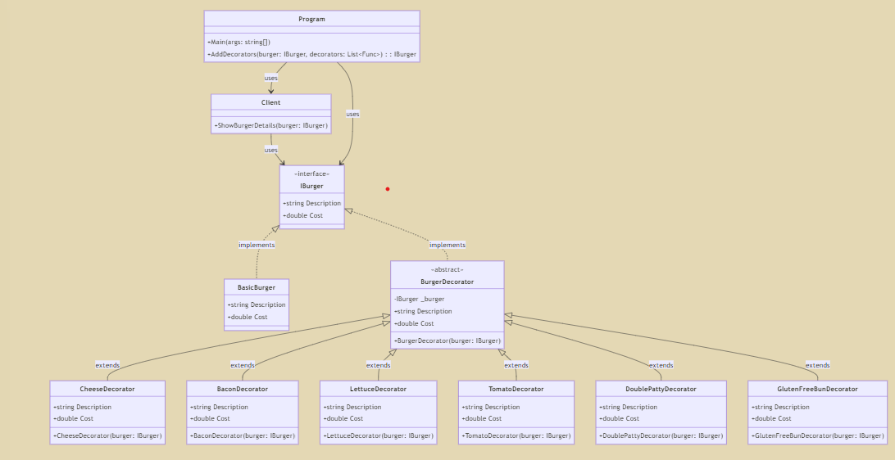

Цей код використовує паттерн Декоратор для покращення базового бургера різними інгредієнтами та опціями, динамічно змінюючи опис бургера та його вартість.

IBurger визначає загальний інтерфейс з властивостями Description та Cost.
BasicBurger - це конкретна реалізація IBurger, що представляє звичайний бургер.
BurgerDecorator - це абстрактний клас, що реалізує IBurger і містить посилання на об'єкт IBurger, що дозволяє іншим декораторам будувати на його основі.
Конкретні декоратори, такі як CheeseDecorator, BaconDecorator, LettuceDecorator, TomatoDecorator, DoublePattyDecorator та GlutenFreeBunDecorator розширюють BurgerDecorator, додаючи відповідні інгредієнти до опису та вартості бургера.
Клас Client демонструє використання цих декораторів, відображаючи деталі бургера.
Функція AddDecorators динамічно застосовує список декораторів до бургера, крок за кроком покращуючи його характеристики.

# Патерн декоратор (Decorator)

- Потрібно вивчити теоретичний матеріал та написати власноруч приклад коду для патерну decorator. Деяку теоретичну інформацію можна почерпнути тут https://refactoring.guru/uk/design-patterns/decorator
- Закомітити приклад НАПИСАНИЙ власноруч та зробити pull request.
- Згідно власного варіанту потрібно переписати існуючий проект та додати за потреби нові класи. Варіанти завдань отримати у викладача.
- В README файлі навести UML діаграму класів для коду згідно власного варіанту з короткими поясненнями.
- Закомітити код та зробити pull request.

## Варіанти індивідуальних завдань для патерну "Декоратор"

14. **Декоратор для системи бургерів з різними варіаціями**
    Розробити декоратори для базового бургера, які додають інгредієнти та варіанти подачі, змінюючи ціну в залежності від додавань.
